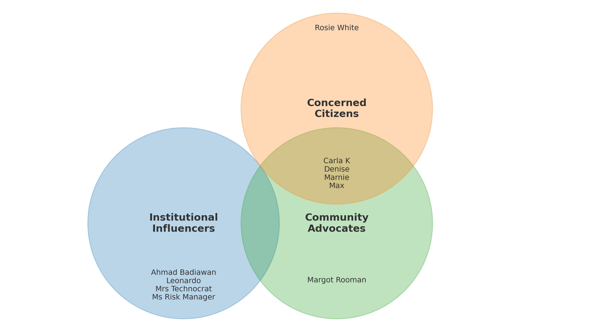

# 📊 Chemical Atlas User Personas – Key Trends Report

## 🎯 Overview

Each member of the group created a user persona using a predefined template. While these personas were not based on empirical data, they served as simplified archetypes that revealed assumptions we held about potential users of the chemical atlas. This process allowed us to identify commonly held ideas within the group and develop a more targeted approach to defining the project scope.

## 👥 Roles and Backgrounds

- **Broader Trends**:
  - A mix of **institutional (government, EU policymakers)** and **grassroots (parents, teachers, campaigners)** roles.
  - Several users are **community stakeholders** concerned with **environmental justice**.
  - Backgrounds range from **policy and environmental science** to **non-expert but civically active individuals**.

## 🎯 Goals

- Raise awareness of pollution and chemical risks
- Empower communities with credible data
- Shape policy through evidence and storytelling
- Educate others, especially younger generations and parents

## ⚠️ Challenges

- Lack of usable or localized data
- Overly technical platforms unsuitable for lay users
- Low institutional support or feeling ignored by authorities
- Isolation in civic efforts due to lack of expert backing

## 🌐 Website Needs

- Clear, zoomable geographic data with contextual explanations
- Visually simple and trustworthy information
- Tools for advocacy, like case studies and shareable content

## 🖥️ Technical Fluency

- Ranges from **basic to intermediate**
- Strong preference for:
  - Web-based platforms
  - Simple navigation and data visualization
  - No need for technical training or background

## 🛠️ Preferred Tools/Platforms

- **Websites and reports** (professionals)
- **Social media (Facebook, Instagram)** (community actors)
- Platforms that support **information sharing and public engagement**

## ❤️ Emotional Drivers

- Protecting children and community health
- Fear of long-term environmental degradation
- Desire for empowerment and visibility in policy spaces
- Frustration with being excluded from expert discourse

## 🧩 User Group Overview

Personas were grouped into three overlapping user types based on role, technical fluency, and purpose:

- **Institutional Influencers**  
  *Policy makers, regulators, and scientific advisors*  
  _Example: Ahmad Badiawan, Leonardo_

- **Community Advocates**  
  *Local teachers, campaigners, and educators*  
  _Example: Carla K, Margot Rooman_

- **Concerned Citizens**  
  *Motivated individuals without formal influence*  
  _Example: Rosie White, Max_

### 🔄 Overlapping Roles

Some personas, such as Carla K and Denise, bridge **Community Advocate** and **Concerned Citizen**, highlighting how roles are fluid and context-dependent.

